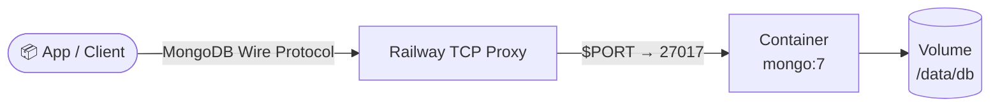

# MongoDB for railway.app


Deploy MongoDB 7 on Railway with the official Docker image.

[](https://railway.com/deploy/mongodb-vb?referralCode=2_sIT9&utm_medium=integration&utm_source=template&utm_campaign=generic)

## 🏗️ Architecture



## Environment

| Variable | Required | Description |
|----------|----------|-------------|
| `MONGO_INITDB_ROOT_USERNAME` | Yes | Root username created on first start of an empty volume. Set this in the Railway dashboard as a generated secret. |
| `MONGO_INITDB_ROOT_PASSWORD` | Yes | Root password created on first start of an empty volume. Set this in the Railway dashboard as a generated secret. |

Both variables must be set together before the first deployment — MongoDB only
enables authentication and creates the root user on an empty data directory.
Deploying without them leaves the database unauthenticated and reachable by
anyone with network access to it. See [`.env.example`](./.env.example) for local development.

## Optional

| Variable | Description |
|----------|-------------|
| `MONGO_INIT_DUMP_URL` | HTTPS URL to a `mongorestore`-compatible single-file archive (`mongodump --archive[--gzip]` output, **not** a `mongodump --out` directory tree); downloaded and restored via `mongorestore --archive --drop` automatically, but only on the first start of an empty volume. Takes precedence over `MONGO_INIT_DUMP_BASE64` if both are set. |
| `MONGO_INIT_DUMP_BASE64` | Same archive, base64-encoded and pasted directly as the variable value. Ignored if `MONGO_INIT_DUMP_URL` is also set. Best for small dumps only. |

> [!NOTE]
> `MONGO_INIT_DUMP_URL`/`MONGO_INIT_DUMP_BASE64` are only ever consulted on the very first start against a brand-new, empty volume. Once the database has initialized, both variables are silently ignored on every later restart or redeploy — even if you leave them set. The restore runs with full administrative privileges during bootstrap, so only point these at dumps from sources you trust.

## Health Check

The image defines a `HEALTHCHECK` that runs `mongosh --eval "db.adminCommand('ping')"`
every 30 seconds so container orchestrators (including Railway) can detect an
unhealthy instance.

## Persistence

`railway.toml` declares `requiredMountPath = "/data/db"`. Attach a Railway volume to that path before production traffic — Railway will prompt for it based on this setting, but it is not created automatically.

## Local

```bash
cp .env.example .env
docker build -t railwayapp-mongodb .
docker run --rm -p 27017:27017 --env-file .env railwayapp-mongodb
```

<!-- footer -->
---

[](https://github.com/vergissberlin/railwayapp-airbyte) [](https://github.com/vergissberlin/railwayapp-airflow) [](https://github.com/vergissberlin/railwayapp-cloudbeaver-ce) [](https://github.com/vergissberlin/railwayapp-codimd) [](https://github.com/vergissberlin/railwayapp-django) [](https://github.com/vergissberlin/railwayapp-email) [](https://github.com/vergissberlin/railwayapp-fastapi) [](https://github.com/vergissberlin/railwayapp-flask) [](https://github.com/vergissberlin/railwayapp-flowise) [](https://github.com/vergissberlin/railwayapp-gitlab) [](https://github.com/vergissberlin/railwayapp-grafana) [](https://github.com/vergissberlin/railwayapp-homeassistant) [](https://github.com/vergissberlin/railwayapp-influxdb) [](https://github.com/vergissberlin/railwayapp-mjml) [](https://github.com/vergissberlin/railwayapp-mongodb) [](https://github.com/vergissberlin/railwayapp-mqtt) [](https://github.com/vergissberlin/railwayapp-mysql) [](https://github.com/vergissberlin/railwayapp-n8n) [](https://github.com/vergissberlin/railwayapp-nodejs) [](https://github.com/vergissberlin/railwayapp-nodered) [](https://github.com/vergissberlin/railwayapp-opensearch) [](https://github.com/vergissberlin/railwayapp-outerbase-studio) [](https://github.com/vergissberlin/railwayapp-postgresql) [](https://github.com/vergissberlin/railwayapp-redis) [](https://github.com/vergissberlin/railwayapp-typo3)
